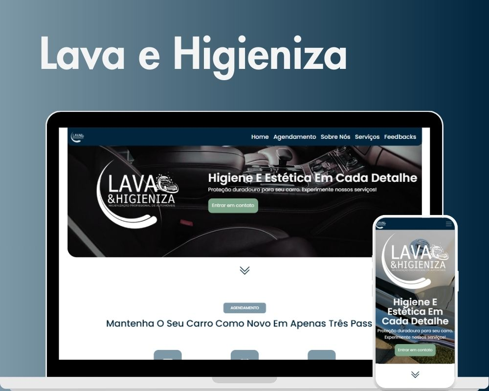

<h1 align="center"> Lava e Higieniza </h1>

  <a href="#-tecnologias">Tecnologias</a>&nbsp;&nbsp;&nbsp;|&nbsp;&nbsp;&nbsp;
  <a href="#-projeto">Projeto</a>&nbsp;&nbsp;&nbsp;|&nbsp;&nbsp;&nbsp;
  <a href="#-licença">Licença</a>

  

 

  

## 🚀 Tecnologias

Esse projeto foi desenvolvido com as seguintes tecnologias:

- HTML e CSS
- Bootstrap
- JavaScript e SwiperJS
- Git e Github

## 💻 Projeto

Essa página foi feita como um projeto de extensão acadêmico que busca agrupar as informações sobre a empresa lava e higieniza para os usuários que se interessam pelos serviços de estética automotiva que a empresa oferece, visando a conversão de usuários em clientes.

---

Feito por Sullara Tavares